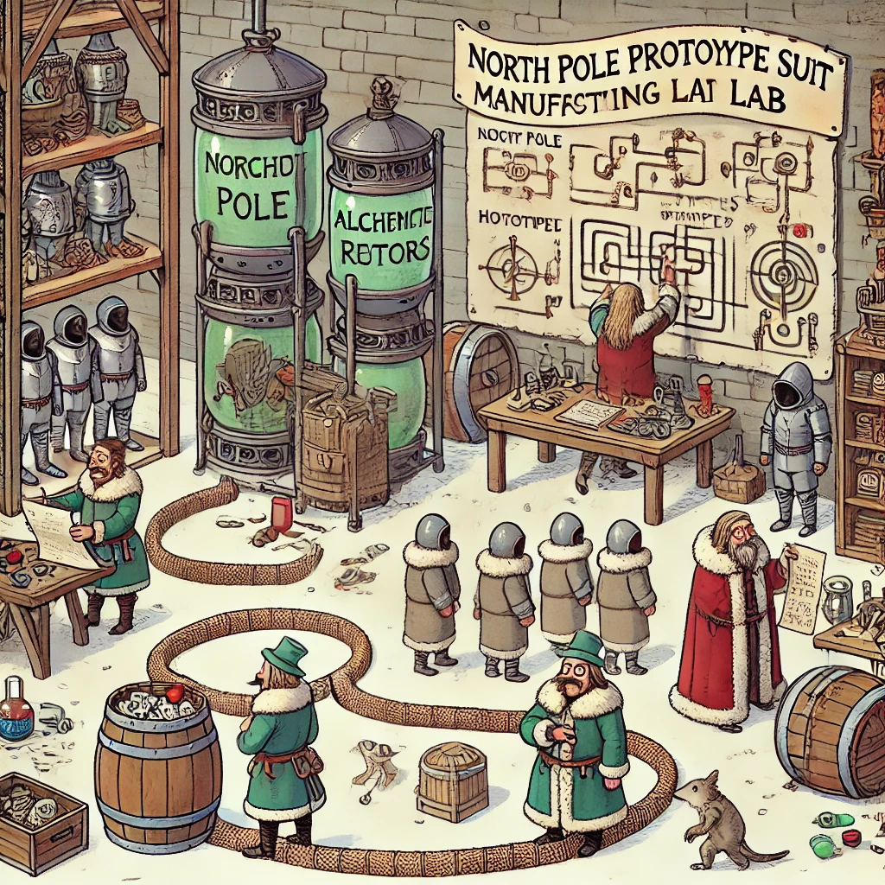
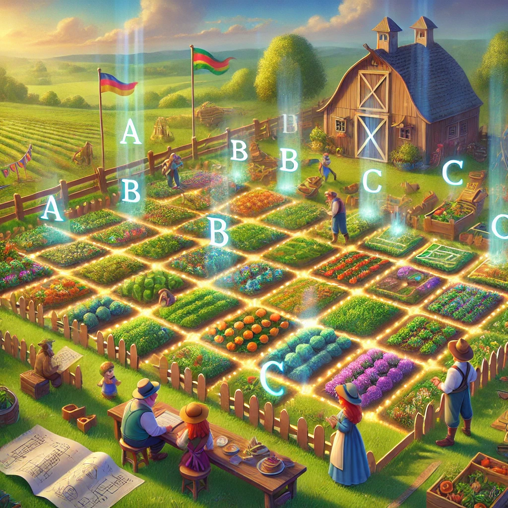

# AOC_2024
https://adventofcode.com/2024

|Mon|Tue|Wed|Thu|Fri|Sat|Sun|
|:-:|:-:|:-:|:-:|:-:|:-:|:-:|
||||||| [1]|
| [2]| [3]| [4]| [5]| [6]| [7]| [8]|
| [9]| [10]| [11]| [12]| [13]| [14]| [15]|
| [16]| [17]| [18]| [19]| [20]| [21]| [22]|
| [23]| [24]| [25]| 26 | 27 | 28 | 29 |
| 30 | 31 |||||      |

## AOC Helper used
https://github.com/eduherminio/AoCHelper
 no automatic download of inputs
 no automatic upload of solutions
 just helper to run solutions and meassure performance

## How to run
add inputs to Inputs/XX.txt
 (XX being day number)
 inputs ommited because: https://adventofcode.com/about#faq_copying

[1]:Solutions/Day01.cs
[2]:Solutions/Day02.cs
[3]:Solutions/Day03.cs
[4]:Solutions/Day04.cs
[5]:Solutions/Day05.cs
[6]:Solutions/Day06.cs
[7]:Solutions/Day07.cs
[8]:Solutions/Day08.cs
[9]:Solutions/Day09.cs
[10]:Solutions/Day10.cs
[11]:Solutions/Day11.cs
[12]:Solutions/Day12.cs
[13]:Solutions/Day13.cs
[14]:Solutions/Day14.cs
[15]:Solutions/Day15.cs
[16]:Solutions/Day16.cs
[17]:Solutions/Day17.cs
[18]:Solutions/Day18.cs
[19]:Solutions/Day19.cs
[20]:Solutions/Day20.cs
[21]:Solutions/Day21.cs
[22]:Solutions/Day22.cs
[23]:Solutions/Day23.cs
[24]:Solutions/Day24.cs
[25]:Solutions/Day25.cs
